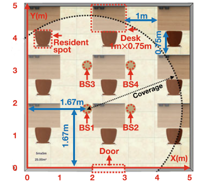
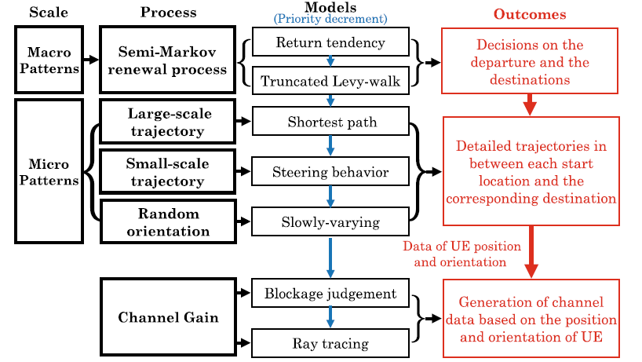
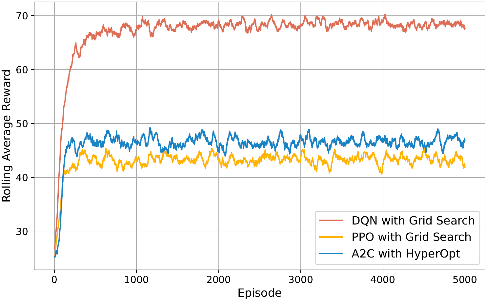
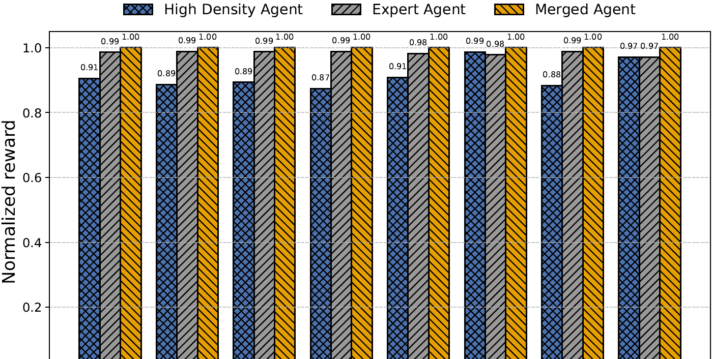

# Generalizable Deep Reinforcement Learning-Based Intelligent Handover in Indoor WiGig Networks


---

##  Project Highlights

- Proposed a **generalizable DRL-based framework** for intelligent handover in indoor WiGig networks  
- Designed a **gain-sensitive reward function** to handle small channel gain differences  
- Compared **DQN, PPO, and A2C** with multiple hyperparameter tuning techniques  
- Demonstrated that **DQN + Grid Search** achieves the best performance  
- Validated **generalization across 1–8 user-density scenarios**  

---

##  Abstract

Indoor WiGig networks operating in the 60 GHz band offer ultra-fast connectivity but suffer from severe blockage and dynamic channel variations. Traditional handover techniques struggle to adapt in such environments.

This project presents a **deep reinforcement learning-based intelligent handover framework** that evaluates DQN, PPO, and A2C combined with hyperparameter tuning techniques such as Grid Search, Random Search, Optuna, and HyperOpt.

A **novel reward function** is introduced to amplify channel gain differences and improve learning stability. Results show that:

- **DQN + Grid Search** achieves the best performance  
- **48% higher reward than A2C**  
- **32% faster convergence than PPO**  
- A **merged agent trained on multiple user densities generalizes effectively**, while a high-density-only model degrades by up to **13%**

---

## 🚀 Key Contributions

- First study on **multi-user indoor WiGig handover using DRL**
- Introduced a **channel-gain-aware reward mechanism**
- Comprehensive evaluation of **hyperparameter tuning strategies**
- Demonstrated **generalization vs expert vs high-density models**
- Showed practicality of **single unified agent vs multiple expert agents**

---

##  Problem Motivation

WiGig networks provide ultra-high-speed communication but are highly sensitive to:

- Blockage (walls, humans, furniture)
- Mobility
- Rapid signal fluctuations

Traditional threshold-based handover methods fail in such dynamic environments.

 This work solves this using **adaptive DRL-based decision-making**.

---

##  System Model

- Indoor environment: **5m × 5m × 3m office**
- **4 WiGig Base Stations (BS)**
- Up to **8 mobile users**
- Realistic **human mobility model**
- Dynamic **LoS / NLoS channel modeling**

<p align="center">
  
  <br>
  <b>Figure 1:</b> Indoor WiGig environment.
</p>

<p align="center">
  
  <br>
  <b>Figure 2:</b> Mobility and channel modeling framework.
</p>

---

##  Data Generation

- Generated datasets for **1–8 users**
- Simulated:
  - entering
  - moving
  - exiting scenarios

### Preprocessing

- Applied **Min-Max normalization**
- Scaled channel gains to **[0,1]**
- Ensured stable and fair RL learning

---

##  RL Framework

### Agents

- **DQN (Value-based)**
- **PPO (Policy-based)**
- **A2C (Actor-Critic)**

### State
- Channel gains from **4 BSs**

### Action
- Select BS / trigger handover

### Objective
- Maximize QoS  
- Minimize unnecessary handovers  

<p align="center">
  
  <br>
  <b>Figure 3:</b> RL-based handover framework.
</p>

---

##  Reward Function

Custom gain-sensitive reward:

- Reward switching only if gain improvement > threshold (5%)
- Penalize unnecessary handovers
- Reward staying when connection is strong

 Improves:
- Convergence speed  
- Decision accuracy  
- Stability  

---

##  Hyperparameter Tuning

Evaluated:

- Grid Search
- Random Search
- Optuna
- HyperOpt

### Best Results

| Agent | Best Method |
|------|------------|
| PPO  | Grid Search |
| A2C  | HyperOpt |
| DQN  | Grid Search |

---

#  Results

##  Before Hyperparameter Tuning

| Agent | Avg Rolling Reward | Convergence Time (s) | FPS |
|------|--------------------|---------------------|-----|
| PPO  | 40.322             | 698.13              | 14.32 |
| A2C  | 43.653             | 662.96              | 15.10 |
| DQN  | 67.5435            | 739.44              | 13.52 |

 **Observation:**
- DQN already outperforms PPO and A2C  
- All models suffer from slower convergence  

---

## 🔹 After Hyperparameter Tuning

### PPO

| Method | Avg Reward | Convergence Time (s) | FPS |
|--------|-----------|---------------------|-----|
| Optuna | 22.23 | 699.84 | 12.66 |
| **Grid Search** | **46.05** | **626.5** | **14.37** |
| Random Search | 44.27 | 13902.76 | 9.62 |
| HyperOpt | 22.23 | 694.29 | 13.21 |

---

### A2C

| Method | Avg Reward | Convergence Time (s) | FPS |
|--------|-----------|---------------------|-----|
| Optuna | 45.95 | 657.62 | 15.08 |
| Grid Search | 42.58 | 886.75 | 15.25 |
| Random Search | 46.30 | 660.12 | 15.30 |
| **HyperOpt** | **46.37** | **655.86** | **15.15** |

---

### DQN

| Method | Avg Reward | Convergence Time (s) | FPS |
|--------|-----------|---------------------|-----|
| Optuna | 67.85 | 716.54 | 13.59 |
| **Grid Search** | **68.04** | **423.66** | **15.17** |
| Random Search | 67.97 | 424.14 | 13.67 |
| HyperOpt | 67.17 | 716.77 | 13.61 |

---

##  Final Comparison (Best Tuned Agents)

| Agent | Best Method | Avg Reward | Convergence Time |
|------|------------|-----------|-----------------|
| PPO  | Grid Search | 46.05 | 626.5 |
| A2C  | HyperOpt | 46.37 | 655.86 |
| **DQN** | **Grid Search** | **68.04** | **423.66** |

---

###  Key Takeaways

- **DQN + Grid Search is the best performing model**
- **+48% reward vs A2C**
- **32% faster convergence vs PPO**
- Hyperparameter tuning significantly improves performance

<p align="center">
  
  <br>
  <b>Figure 4:</b> Rolling reward comparison.
</p>

---

##  Generalization Study

Compared:

-  Merged Agent (trained on 1–8 users)
-  High-density agent (trained only on 8 users)
-  Expert agents (one per density)

### Results

- Merged agent → **Best generalization**
- High-density agent → **Up to 13% performance drop**
- Expert agents → Accurate but impractical

<p align="center">
  
  <br>
  <b>Figure 5:</b> Normalized reward of expert, high density, and merged agents for different user density scenarios.
</p>

---

##  Why This Matters

 A **single generalized RL model** can outperform specialized models  

 Reduces:
- Deployment complexity  
- Memory usage  
- System overhead  

 Enables:
- Scalable intelligent wireless systems  
- Real-time adaptive handover  
- Future 6G-ready AI networking  

---

<!--Please do not hesitate to contribute to this project and cite us:
```
@INPROCEEDINGS{11310213,
  author={Kaddour, Hamza and Hasan, Eslam and Fouda, Mostafa M. and Ismail, Muhammad and Fadlullah, Zubair Md and Kato, Nei},
  booktitle={2025 IEEE 102nd Vehicular Technology Conference (VTC2025-Fall)}, 
  title={Generalizable Deep Reinforcement Learning-Based Intelligent Handover in Indoor WiGig Networks}, 
  year={2025},
  volume={},
  number={},
  pages={1-7},
  keywords={Training;Vehicular and wireless technologies;Scalability;Decision making;Handover;Deep reinforcement learning;Real-time systems;IEEE 802.11 Standard;Optimization;Convergence;Deep reinforcement learning;Indoor WiGig networks;Intelligent handover},
  doi={10.1109/VTC2025-Fall65116.2025.11310213}}

-->
